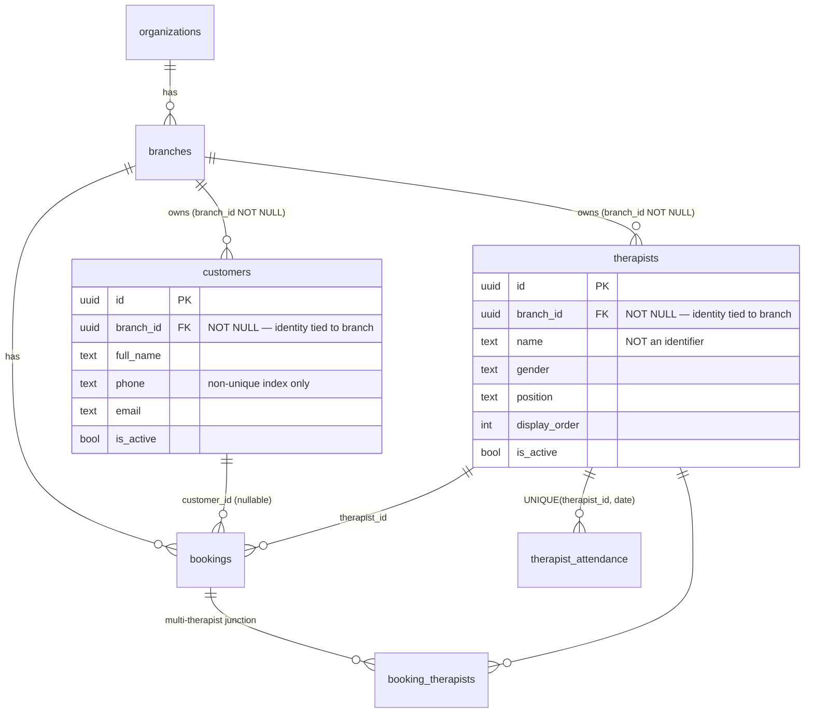
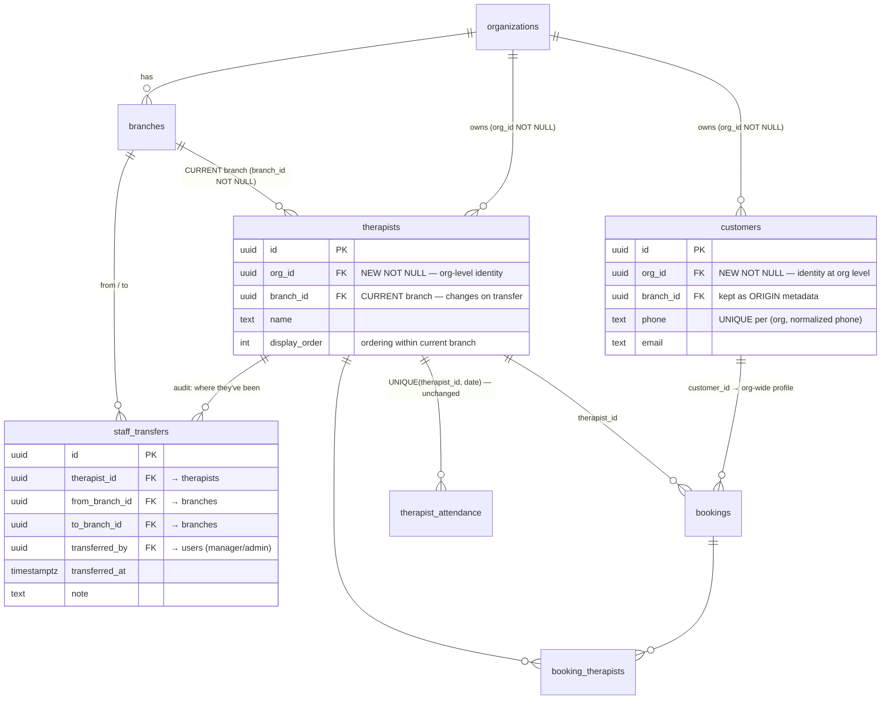
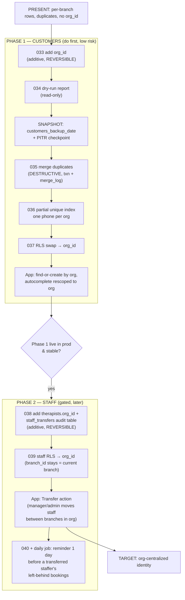

# Architecture — Centralizing Customer & Staff Data

> Companion to [`centralize-customer-staff-data.md`](./centralize-customer-staff-data.md).
> Shows the **present (per-branch)** model vs the **target (per-organization)** model and the
> transition between them. Diagrams use Mermaid (renders on GitHub) with ASCII fallbacks.

---

## 1. The core problem in one picture

```
PRESENT — identity is keyed by BRANCH                TARGET — identity is keyed by ORG
────────────────────────────────────                ──────────────────────────────────

  Org: Nuad Thai                                       Org: Nuad Thai
  ├─ Branch: Lazimpat                                  ├─ ONE customer record  ── visits ──▶ Lazimpat
  │   └─ Customer "Ram" (phone 98...) ◀── dup          │                        └─ visits ──▶ Sanepa
  ├─ Branch: Sanepa                                    └─ ONE staff record at CURRENT branch
  │   └─ Customer "Ram" (phone 98...) ◀── dup              Lazimpat ── transfer ──▶ Sanepa
  └─ same person = TWO unrelated rows                  customer history spans org; staff move by transfer
```

**Customers** — the same human becomes multiple disconnected rows today because `branch_id` is part
of identity. Centralizing moves identity up to `org_id` so booking history and the
outstanding/credit ledger follow the person across branches.

**Staff** — a staffer stays at **exactly one branch at a time** (their current branch). Instead of
duplicating a row to put them at a second branch, a **branch manager/admin transfers** them to
another branch in the same org. After a transfer the staffer is owned by the destination branch, and
only **that** branch's manager/admin can transfer them onward (e.g. back). `org_id` is added so
transfers stay within the org and identity is org-scoped.

---

## 2. PRESENT state — data model (as-is)



**Key facts about the present model:**
- `customers` and `therapists` have **no `org_id`** — org is only reachable by JOIN through `branches`.
- `customers.phone` has a **non-unique** index → duplicates allowed even within one branch.
- Only child FK to `customers` is `bookings.customer_id` (nullable) → **low-risk merge**.
- Staff has **3 constrained child FKs**: `booking_therapists` `UNIQUE(booking_id, therapist_id)`,
  `therapist_attendance` `UNIQUE(therapist_id, date)`, and (target) memberships → **merge needs
  collision handling**.

### Present read path (RLS already org-wide, identity is not)
```
Staff UI ──▶ api.js (filter by branch_id) ──▶ supabase ──▶ RLS derives org via JOIN branches
   New-Booking autocomplete shows ONLY this branch's customers ──▶ returning cross-branch
   customer is invisible ──▶ save creates a DUPLICATE row.
```

---

## 3. TARGET state — data model (to-be)



**What changes:**
- **Customers:** add `org_id` (NOT NULL), merge duplicates by `(org_id, normalized phone)`, add a
  **partial unique index** `customers_org_nphone_uniq` so one phone = one customer per org. `branch_id`
  is kept only as "origin branch" metadata.
- **Staff:** `therapists` gets `org_id` (org-level identity) but `branch_id` stays **NOT NULL and is
  the staffer's CURRENT branch**. A **transfer** updates `branch_id` to another branch in the same
  org and writes an audit row to the new **`staff_transfers`** table. No simultaneous multi-branch,
  no membership junction.
- **Attendance uniqueness stays `(therapist_id, date)`** — unchanged, because a staffer is at one
  branch at a time. (No irreversible constraint swap.)

### Target read path + transfer flow
```
Staff UI ──▶ api.js (customers filtered by org_id) ──▶ RLS: org_id = get_user_org_id()
   New-Booking autocomplete shows ALL org customers ──▶ returning cross-branch customer
   appears ──▶ save links to the single org profile (no duplicate).

Staff list  ──▶ still filtered by therapists.branch_id (current branch), ordered by display_order.

Transfer    ──▶ manager/admin of the staffer's CURRENT branch picks a target branch (same org)
            ──▶ transferTherapist(id, toBranchId): authz check ▸ UPDATE therapists.branch_id
                ▸ INSERT staff_transfers(from, to, by) ▸ recompute display_order at destination.
            ──▶ now the DESTINATION branch's manager/admin owns the staffer (must transfer back).
```

---

## 4. The transition (how we get from present → target safely)



**Sequencing rule (per phase):** additive DB change first → ship frontend → then run the reviewed
/destructive SQL. The app never points at a column that doesn't exist yet.

---

## 5. Two databases — code vs data (why "come back" works)

```
   GIT (frontend only)                 DATABASES (data — never auto-synced)
   ───────────────────                 ─────────────────────────────────────
   feature/* ─▶ stage ─▶ main          STAGING  pmbv… ✗   snzcck… (MCP)  ◀─ stage code
       │          │        │           PROD     pmbvogiphelmpjdalmtv      ◀─ main code
   reverting main rolls                Every DB change runs on BOTH, prod MANUALLY.
   back the APP, never the DB.         Staging is a REHEARSAL, not a backup of prod.
```

- Promoting to prod = **two actions**: (a) merge `stage → main` (frontend), (b) **manually run the
  SQL** in the prod SQL editor. SQL **never** auto-runs on deploy.
- "Come back" for the **destructive** steps = the `*_merge_log` tables + `*_backup_<date>` full-table
  copies + (recommended) a **prod PITR snapshot taken right before** the merge. Additive steps are
  reversed by simply dropping the column/table/index.

---

## 6. Risk asymmetry — why customers go first

| Dimension | Customers (Phase 1) | Staff (Phase 2 — transfer model) |
|---|---|---|
| Identity | merge duplicates by **phone** | keep existing rows; add `org_id`, no merge needed |
| Branch coupling | `branch_id` → origin metadata | `branch_id` = **current branch**, changes on transfer |
| Destructive steps | yes — merge + delete duplicate rows | **none** — purely additive + an UPDATE on transfer |
| New tables | none | `staff_transfers` (audit log) |
| Attendance unique | unaffected | **unchanged** `(therapist_id, date)` — no constraint swap |
| Drives credit feature | **yes** | no |

⇒ Customers first unblocks the outstanding/credit ledger (its only destructive step). The staff
transfer model is **additive-only** (add `org_id` + audit table + a Transfer UI action), so it
carries far less risk than a row-merge campaign and can ship whenever convenient after Phase 1.
    